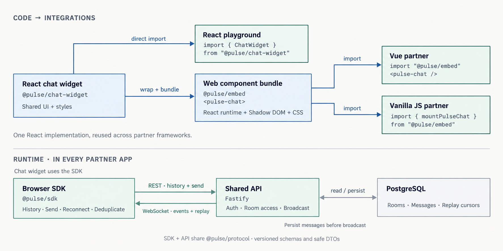

# Widgets

Pulse is a framework-agnostic TypeScript SDK and embeddable live chat widget.
This repository demonstrates one backend and protocol across unrelated partner websites.



The SDK and API share versioned schemas from `@pulse/protocol`. A message sent
from one partner site is persisted before being broadcast to other browsers
subscribed to the same room or channel. See [the architecture](docs/architecture.md)
for package boundaries and integration details.

## Status

The versioned protocol and API are implemented. The API serves a seeded room
backed by PostgreSQL, issues short-lived demo JWTs, returns paginated history,
accepts idempotent messages, and broadcasts them through authenticated WebSocket
subscriptions. The framework-independent browser SDK adds typed REST calls,
deduplication, cursor resume, and reconnect handling. The accessible React widget
adds connection states, history, live messages, sending, and scoped theme tokens.
The browser embed exposes the same UI as a Shadow DOM custom element for Vue,
Svelte, and plain JavaScript. More partner demos are still in progress.

## Partner app deployments

- [Playground](https://widgets-playground-two.vercel.app)
- [Vue partner app](https://widgets-partner-vue.vercel.app)
- [Vanilla JavaScript partner app](https://widgets-partner-vanilla.vercel.app)

## Development

Use Node.js 24 and pnpm 10.30.3 (pinned in package.json).

```sh
pnpm install
pnpm check
```

Initialized with `pnpm dlx create-turbo@latest`. The default Next.js apps and generic UI package were removed to make room for the planned stack.

| Command          | Purpose                                             |
| ---------------- | --------------------------------------------------- |
| `pnpm dev`       | Run development servers once app packages are added |
| `pnpm build`     | Build workspace packages                            |
| `pnpm lint`      | Run package linters                                 |
| `pnpm typecheck` | Run package check-types scripts                     |
| `pnpm test`      | Run package tests                                   |
| `pnpm format`    | Format source and documentation                     |
| `pnpm check`     | Check formatting, lint, types, tests, and builds    |

### Run the API

```sh
docker compose up -d postgres
cp apps/api/.env.example apps/api/.env
pnpm --filter @pulse/api db:setup
pnpm --filter @pulse/api dev
```

The local API listens on `http://127.0.0.1:4000`. Start with
`POST /auth/demo-token`, passing a stable anonymous session such as
`{ "sessionId": "<uuid>", "source": "playground" }`, then use the returned
bearer token with the room and message endpoints. The API assigns a stable
adjective–animal display name to that source/session pair. Messages and replay
cursors persist across API restarts in the local PostgreSQL volume.

The API uses the in-memory store when `DATABASE_URL` is absent, which keeps unit
tests and quick local experiments self-contained. Production startup requires
both `DATABASE_URL` and `PULSE_TOKEN_SECRET`.

## Workspace

- `apps/`: reserved for the API, playground, and partner demos.
- `apps/partner-vanilla`: independently runnable plain TypeScript integration using the embed.
- `apps/partner-vue`: independently runnable Vue integration using the same custom element.
- `packages/eslint-config`: shared base and React lint configurations.
- `packages/chat-widget`: accessible, themeable React chat UI.
- `packages/embed`: framework-neutral `<pulse-chat>` custom element and mount API.
- `packages/protocol`: versioned runtime schemas and public DTOs.
- `packages/sdk`: browser-safe REST and realtime client.
- `packages/typescript-config`: shared strict TypeScript configurations.
- `docs/architecture.md`: planned boundaries and delivery phases.
- `docs/decisions.md`: implementation decisions and tradeoffs.

### Channels

The widget includes a collapsible left sidebar for creating and selecting
channels. Channels are shared by everyone who has access to the configured
`roomId`; the original room remains selectable. Names can contain up to 120
characters. Use **Refresh channels** to discover channels created in another
client (the list also refreshes when the browser regains focus).

The SDK exposes `getChannels(roomId)` and `createChannel(roomId, name)` through
`GET /rooms/:id/channels` and `POST /rooms/:id/channels`. Apply the database
migrations with `pnpm --filter @pulse/api db:migrate` before running this version
against an existing PostgreSQL database. Memory-mode channels last only until
the API restarts. Switching channels clears the unsent draft.
